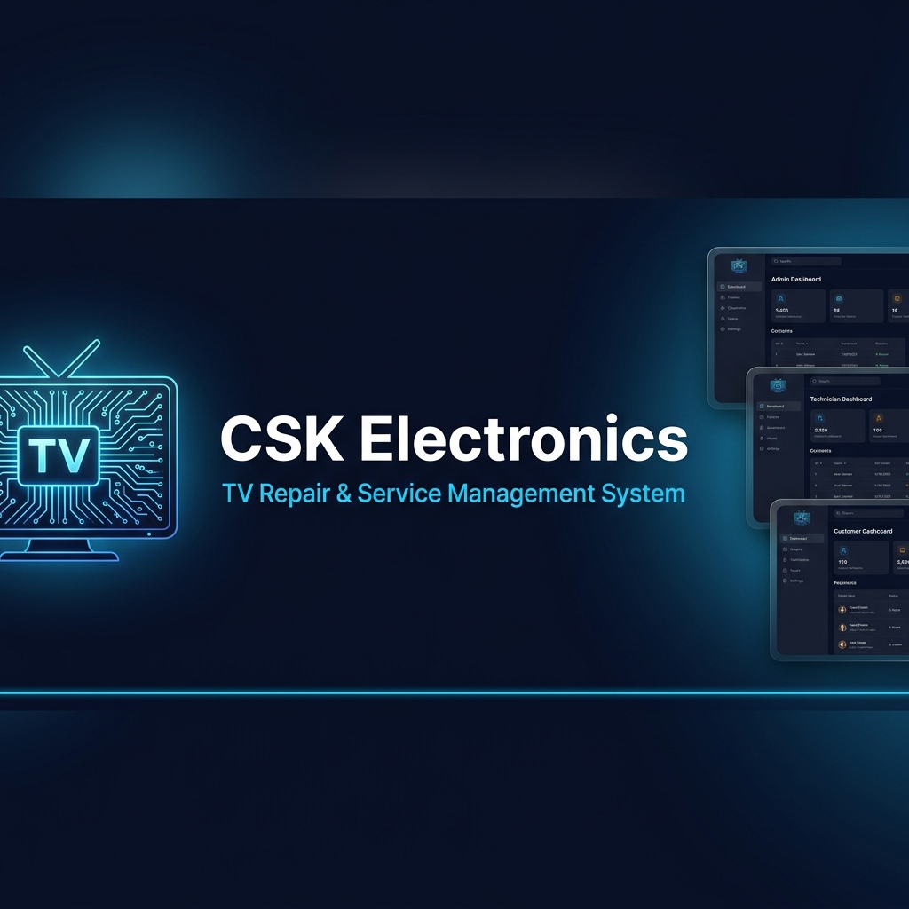
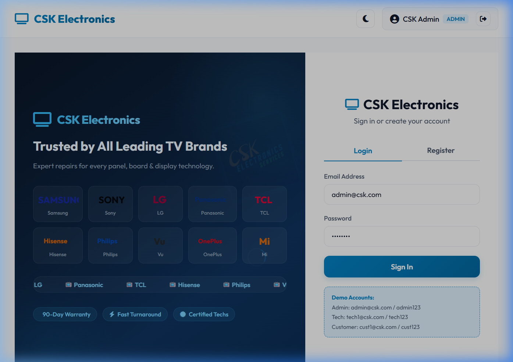
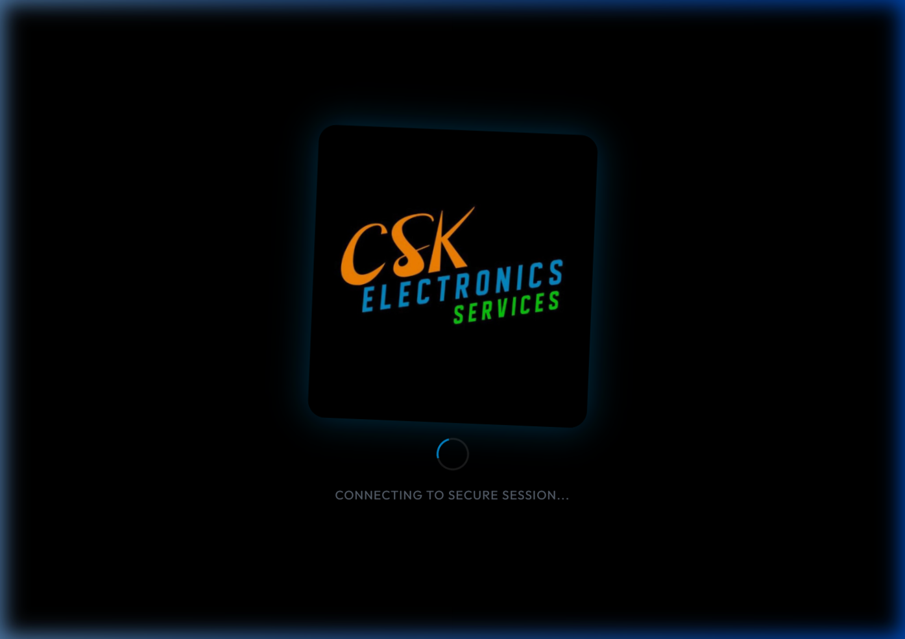
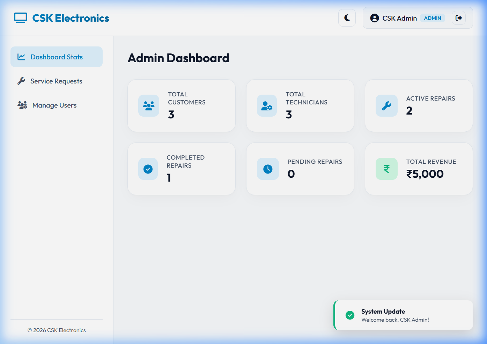
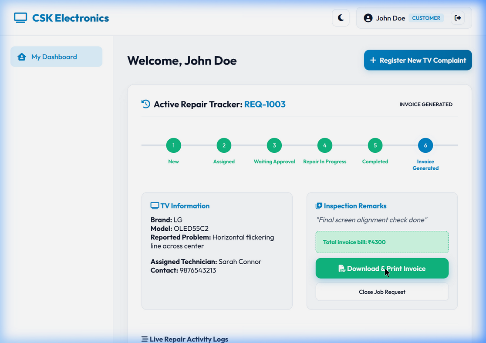
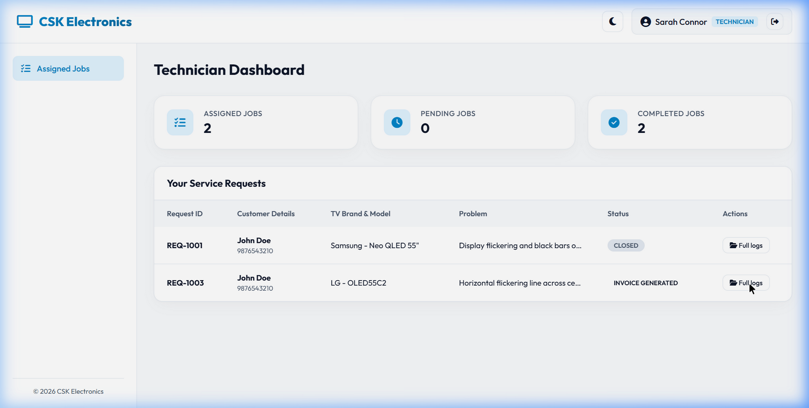
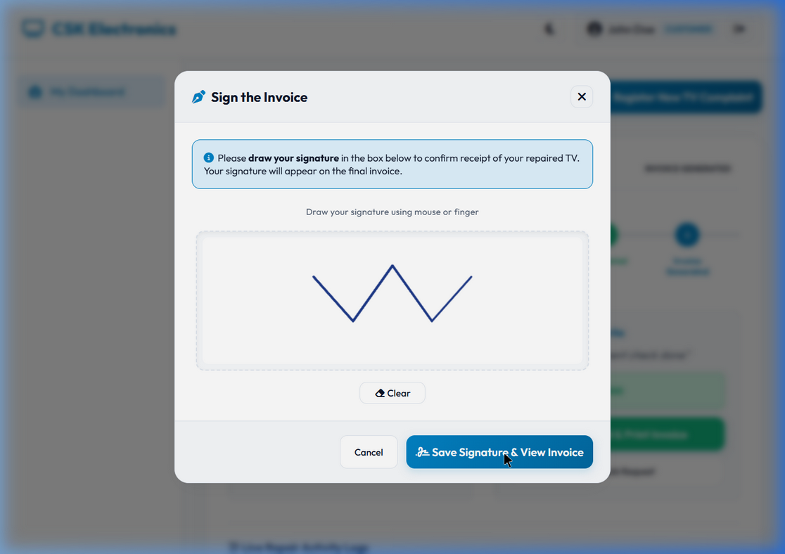
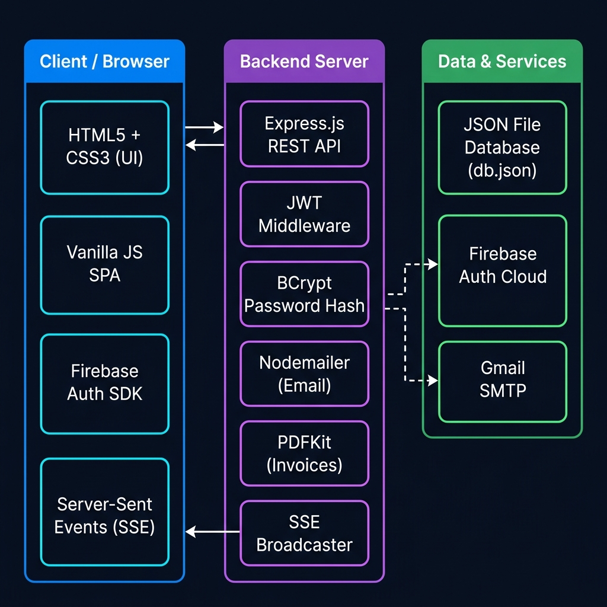
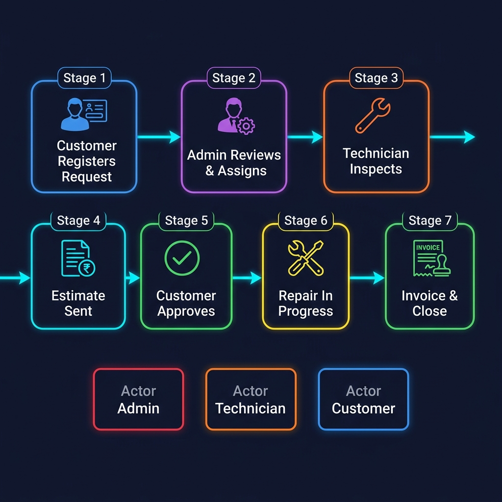

<div align="center">



# 📺 CSK Electronics — TV Repair & Service Management System

[](https://nodejs.org/)
[](https://expressjs.com/)
[](https://firebase.google.com/)
[](LICENSE)
[](https://github.com/CHILKUR-DATTATHREYA/csk)

> A modern, full-stack Single Page Application (SPA) built to digitize and streamline the complete TV repair lifecycle — from customer request to signed invoice delivery.

</div>

---

## 📑 Table of Contents

- [🚀 Key Features](#-key-features)
- [📸 Screenshots](#-screenshots)
- [🏗️ System Architecture](#️-system-architecture)
- [🔄 Repair Workflow](#-repair-workflow)
- [🛠️ Technology Stack](#️-technology-stack)
- [📦 Dependencies](#-dependencies)
- [🏃 Quick Start](#-quick-start)
- [👤 Demo Accounts](#-demo-accounts-default-credentials)
- [📁 Project Structure](#-project-structure)
- [🔐 Security](#-security)
- [📧 Email Notifications](#-email-notifications)
- [📊 Audit & Reporting](#-audit--reporting)

---

## 🚀 Key Features

### 👥 Multi-Role Access Control
| Role | Capabilities |
|---|---|
| **Admin** | Full system control — manage users, assign technicians, view audit logs, generate reports, manage estimates & invoices |
| **Technician** | Accept jobs, submit inspection findings, create estimates, update repair status, generate invoices |
| **Customer** | Submit repair requests, track repair progress in real-time, approve/reject estimates, sign & download invoices |

### 🎨 Premium UI/UX
- **Dark / Light Mode** toggle with system preference detection
- **Glassmorphic card design** with neon blue border glow effects
- **Micro-animations** — hover lifts, fade-ins, slide transitions
- **Cinematic logo transition** on login — full-screen rotate, scale & pulse animation
- **Responsive layout** with custom scrollbars

### ⚡ Real-Time Live Sync
- **Server-Sent Events (SSE)** push updates to all connected dashboards instantly — no refresh needed
- Live repair status changes reflect across Admin, Technician, and Customer views simultaneously

### 📊 Clickable Admin Dashboard
- Stats cards for Customers, Technicians, Active/Completed/Pending Repairs, and Revenue
- **Click any card** to view a detailed records popup with full data table
- Revenue card shows per-invoice breakdown with grand total summary

### 🧑‍💻 Smart Technician Assignment
- **Auto-assignment** based on lowest current workload
- **Manual reassignment** available to Admin at any stage
- Assignment history tracked in audit logs

### ✍️ Digital Invoice with Signature
- Customers sign on an interactive **HTML5 Canvas signature pad** (mouse & touch support)
- Invoice stamped with **CSK Authorized rubber stamp** seal
- One-click **PDF download** of signed invoice (generated server-side with PDFKit)

### 📧 Automated Email Notifications
- Welcome email with credentials sent when Admin creates a new Technician or Customer
- Email notifications for estimate submissions, approvals, and invoice generation
- Configurable SMTP via Admin panel (Gmail / any SMTP provider)

### 📋 Comprehensive Audit Report
- Every action logged: user creation, removal, request lifecycle, estimate/invoice events
- Admin-only access with filterable, timestamped table
- Tracks actor (who did it), action (what happened), target (which record), and timestamp

---

## 📸 Screenshots

### 🔑 Login Page
Branded login page with demo credentials helper and animated background.



---

### 🎬 Cinematic Transition
Full-screen animated logo reveal on successful authentication.



---

### 📊 Admin Dashboard
Real-time stats with clickable cards — drill down into records by clicking any metric.



---

### 🗺️ Customer Repair Tracker
Step-by-step interactive progress timeline showing repair stage and history.



---

### 🔧 Technician Dashboard
Job list with full inspection, estimate, and status update workflow.



---

### ✍️ Digital Signature Pad
Mouse & touch canvas for customers to sign off on completed repairs.



---

## 🏗️ System Architecture



The application follows a classic **3-tier architecture**:

```
┌──────────────────┐       REST API / SSE       ┌──────────────────────┐
│   Browser (SPA)  │ ◄────────────────────────► │   Express.js Server  │
│                  │                             │                      │
│  HTML5 + CSS3    │                             │  JWT Authentication  │
│  Vanilla JS      │                             │  BCrypt Hashing      │
│  Firebase SDK    │                             │  Nodemailer (Email)  │
│  SSE Client      │                             │  PDFKit (PDF Gen)    │
└──────────────────┘                             │  SSE Broadcaster     │
                                                 └────────┬─────────────┘
                                                          │
                                           ┌──────────────┼──────────────┐
                                           │              │              │
                                    ┌──────▼───┐  ┌───────▼──┐  ┌───────▼──┐
                                    │ db.json  │  │ Firebase │  │  Gmail   │
                                    │ (Local   │  │  Auth    │  │  SMTP    │
                                    │ Storage) │  │  Cloud   │  │ (Email)  │
                                    └──────────┘  └──────────┘  └──────────┘
```

---

## 🔄 Repair Workflow



```
[Customer]           [Admin]              [Technician]         [System]
    │                   │                      │                   │
    ├── Submit Request ─►│                      │                   │
    │                   ├── Review & Assign ───►│                   │
    │                   │                      ├── Inspect TV       │
    │                   │                      ├── Create Estimate  │
    │◄─── Estimate Notification ───────────────┤                   │
    ├── Approve / Reject►│                      │                   │
    │                   ├── Notify Technician ─►│                   │
    │                   │                      ├── Repair In Progress
    │                   │                      ├── Mark Completed   │
    │                   │                      ├── Generate Invoice  │
    │◄─── Invoice Notification ────────────────┤                   │
    ├── Sign Invoice     │                      │                   │
    ├── Download PDF     │                      │                   │
    │                   ├── Close Request       │                   │
    │                   │                      │         ✅ Done    │
```

---

## 🛠️ Technology Stack

### Frontend
| Technology | Purpose |
|---|---|
| **HTML5** | Semantic SPA structure — single `index.html` with section-based views |
| **CSS3** | Custom properties (vars), glassmorphism, keyframe animations, neon glow |
| **Vanilla JavaScript (ES2022)** | Full SPA router, DOM manipulation, Canvas API, Fetch API |
| **Font Awesome 6** | Icon library (solid, regular, brands) |
| **Google Fonts — Inter** | Modern sans-serif typography |
| **Firebase JS SDK v10** | Client-side authentication integration |

### Backend
| Technology | Purpose |
|---|---|
| **Node.js 18+** | JavaScript runtime environment |
| **Express.js 4.19** | HTTP server, REST API routing, middleware |
| **bcryptjs 2.4** | Secure password hashing (salt rounds: 10) |
| **jsonwebtoken 9.0** | JWT token generation & verification for session auth |
| **nodemailer 9.0** | SMTP email delivery (welcome emails, notifications) |
| **pdfkit 0.19** | Server-side PDF generation for signed invoices |
| **firebase-admin 14** | Server-side Firebase Admin SDK for user sync |
| **cors 2.8** | Cross-Origin Resource Sharing headers |

### Data & Services
| Service | Purpose |
|---|---|
| **db.json** | Lightweight JSON flat-file database with auto-increment IDs |
| **Firebase Authentication** | Cloud identity provider with email/password auth |
| **Gmail / SMTP** | Transactional email delivery via Nodemailer |
| **Server-Sent Events (SSE)** | Real-time server → client push notifications |

---

## 📦 Dependencies

```json
{
  "dependencies": {
    "bcryptjs":       "^2.4.3",
    "cors":           "^2.8.5",
    "express":        "^4.19.2",
    "firebase-admin": "^14.1.0",
    "jsonwebtoken":   "^9.0.2",
    "nodemailer":     "^9.0.1",
    "pdfkit":         "^0.19.1"
  }
}
```

> **No build tools required.** No Webpack, Vite, or Babel — pure HTML/CSS/JS served statically.

---

## 🏃 Quick Start

### 1. Prerequisites
- [Node.js v18+](https://nodejs.org/) installed
- A Gmail account with an [App Password](https://support.google.com/accounts/answer/185833) (for email notifications)
- A [Firebase project](https://console.firebase.google.com/) with Email/Password auth enabled

### 2. Clone & Install
```bash
git clone https://github.com/CHILKUR-DATTATHREYA/csk.git
cd csk
npm install
```

### 3. Configure Firebase (optional)
Replace `firebase-service-account.json` with your own Firebase service account key.
Update the Firebase config object in `public/index.html` with your project credentials.

### 4. Start the Server
```bash
npm start
```

> The application will be live at: **[http://localhost:3000](http://localhost:3000)**

---

## 👤 Demo Accounts (Default Credentials)

| Role | Email | Password |
|:---|:---|:---|
| 🔴 **Administrator** | `cskelectronicservices@gmail.com` | `admin123` |
| 🟠 **Technician** | `tech1@csk.com` | `tech123` |
| 🔵 **Customer** | `cust1@csk.com` | `cust123` |

> ⚠️ Change these credentials in production via the Admin → Manage Users panel.

---

## 📁 Project Structure

```
csk/
│
├── 📄 server.js              # Express server — all REST API endpoints, SSE, auth
├── 📄 db.js                  # JSON database helper (read/write/query/update)
├── 📄 db.json                # Flat-file database (users, requests, estimates, invoices, audit logs)
├── 📄 mailService.js         # Nodemailer email templates and sender functions
├── 📄 package.json           # Node.js project manifest & dependency list
│
├── 📁 public/                # Static frontend (served by Express)
│   ├── 📄 index.html         # Single HTML file — all views and modals
│   ├── 📄 app.js             # Full SPA logic — router, API calls, DOM renders
│   └── 📄 styles.css         # Complete design system — tokens, components, animations
│
└── 📁 screenshots/           # README documentation images
    ├── 🖼️ banner.png
    ├── 🖼️ login_page.png
    ├── 🖼️ transition.png
    ├── 🖼️ admin_dashboard.png
    ├── 🖼️ technician_dashboard.png
    ├── 🖼️ customer_dashboard.png
    ├── 🖼️ signature.png
    ├── 🖼️ architecture.png
    └── 🖼️ workflow.png
```

---

## 🔐 Security

| Concern | Implementation |
|---|---|
| **Password Storage** | `bcryptjs` with 10 salt rounds — never stored in plaintext |
| **Session Auth** | JWT tokens (1-hour expiry) validated on every protected API route |
| **Firebase Auth** | Cloud-grade identity provider with email verification support |
| **Admin-Only Routes** | Middleware checks `req.user.role === 'admin'` on all admin endpoints |
| **CORS** | Configured to allow same-origin requests only in production |
| **Audit Trail** | Every sensitive action (user create/delete, invoice generate) is logged with actor, timestamp |

---

## 📧 Email Notifications

Emails are sent automatically via **Nodemailer** in the following events:

| Trigger | Recipient | Content |
|---|---|---|
| Admin creates Technician | Technician | Welcome email with login credentials |
| Admin creates Customer | Customer | Welcome email with login credentials |
| Estimate submitted | Customer | Notification with estimate amount |
| Estimate approved | Technician | Approval confirmation |
| Invoice generated | Customer | Invoice ready notification |

> Configure SMTP settings in **Admin Panel → Email Settings**.

---

## 📊 Audit & Reporting

The Admin's **Audit Report** tab tracks the complete interaction lifecycle:

| Column | Description |
|---|---|
| **Timestamp** | Exact date and time of the action |
| **Actor** | Who performed the action (Admin / Technician / Customer) |
| **Action** | What happened (Created, Removed, Updated, Approved, etc.) |
| **Target** | Which record or user was affected |
| **Details** | Additional context (e.g., old status → new status) |

---

## 📜 License

This project is licensed under the **MIT License** — free to use, modify, and distribute.

---

<div align="center">

Developed with ❤️ by **[CHILKUR DATTATHREYA](https://github.com/CHILKUR-DATTATHREYA)**

[](https://github.com/CHILKUR-DATTATHREYA)

*CSK Electronics © 2025 — Empowering TV Repair with Technology*

</div>
